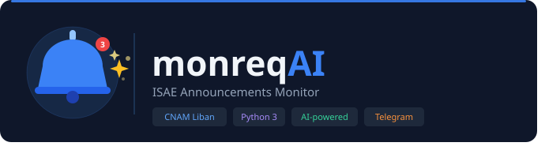
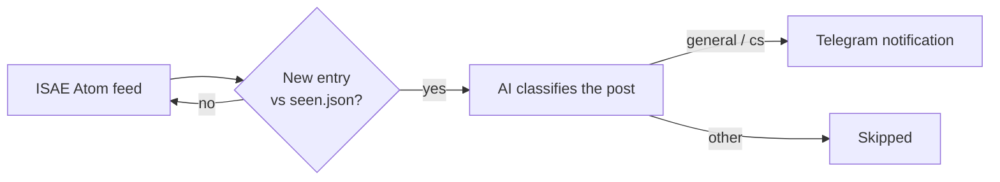

<p align="center">
  
</p>

<h1 align="center">ISAE Announcements Monitor</h1>
<p align="center">Turns the ISAE announcements page into a push notification, filtered to what actually concerns you.</p>

<p align="center">
  
  
</p>

## The problem

ISAE's announcements (isae.edu.lb, part of CNAM Liban) go up on a Blogger page with no notification system attached. If you don't check it, you find out about a moved exam, a cancelled class, or a deadline change after the fact, usually from a classmate who happened to look. Most posts also aren't even about you: a CS student doesn't need to see every general-department memo, and vice versa.

This tool watches the page for you and only pings you when something new and relevant shows up.

## How it works

The site runs on Blogger, so instead of scraping HTML, the tool reads its Atom feed directly:

```
http://annonces.isae.edu.lb/feeds/posts/default
```



On each run:

1. Fetch the feed and diff it against a local record of already-seen announcements (`seen.json`).
2. Post it, unconditionally, to a **general Telegram channel**: every new announcement lands there regardless of category.
3. Ask an AI model to classify it as:
   - `general`: relevant to all students
   - `cs`: relevant to Computer Science students specifically
   - `other`: a different department, or not academic
4. If it's `cs` (or another department that later gets its own channel), also post it to that **department-specific channel**.

## Features

- Reads the real Atom feed, so it doesn't break every time the page's HTML changes
- Filters by relevance instead of forwarding every single post
- Tracks what's already been seen, so you're never notified twice for the same announcement
- Built to run unattended on a schedule (cron, GitHub Actions, or similar) rather than as a long-running process

## Requirements

- Python 3
- Dependencies listed in `requirements.txt`

```bash
pip install -r requirements.txt
```

## Configuration

Set as environment variables (never hardcode these):

```bash
export AI_API_KEY="your_key"
export TELEGRAM_BOT_TOKEN="your_bot_token"
export TELEGRAM_CHANNEL_GENERAL="general_channel_chat_id"
export TELEGRAM_CHANNEL_CS="cs_channel_chat_id"
```

| Variable | Used for |
|---|---|
| `AI_API_KEY` | API key for the AI classification model |
| `TELEGRAM_BOT_TOKEN` | Telegram bot used to send notifications |
| `TELEGRAM_CHANNEL_GENERAL` | Channel that gets every new announcement |
| `TELEGRAM_CHANNEL_CS` | Channel that gets only CS-classified announcements |

A department channel is optional: if its env var isn't set, that department's posts still reach the general channel, they just skip the dedicated one. To add another department's channel later, add an env var for it and one line in `DEPARTMENT_CHANNELS` in `monitor.py`.

## Running

```bash
python3 monitor.py
```

Meant to run on a schedule, not continuously; a cron job every 15–30 minutes is enough for an announcements page.

## Testing

- `test_local.py`: simulates the feed with fake entries to check the "detect new announcement" logic without hitting the network
- `test_classify.py`: runs the AI classification against a few real sample announcements

```bash
python3 test_local.py
python3 test_classify.py
```

## Status

Work in progress, currently built for a single recipient.

- [x] Feed polling and diffing against `seen.json`
- [x] AI-based relevance classification
- [x] Telegram delivery: general channel (all posts) + per-department channel (currently just CS)
- [ ] More department channels (civil, electrical, ...): needs the classifier's categories expanded first
- [ ] Multi-subscriber support

## Contributing

If you're at ISAE or CNAM Liban and this would save you from refreshing a Blogger page every day, contributions are welcome, especially on the Telegram delivery and multi-subscriber pieces above.
