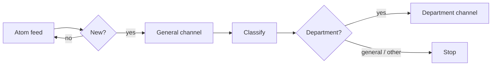

<p align="center">
  
</p>

<h1 align="center">ISAE Announcements Monitor</h1>
<p align="center">Turns the ISSAE / Cnam Liban announcements page into a push notification, routed to the department it actually concerns.</p>

<p align="center">
  
  
  
</p>

## The problem

ISSAE's announcements go up on a Blogger page with no notification attached. If you don't check it, you find out about a moved exam or a changed deadline after the fact, usually from a classmate who happened to look. Most posts aren't about you either: an Informatique student doesn't need every Génie Civil memo.

This watches the page and pings you only when something new and relevant appears.

## How it works

The site runs on Blogger, so rather than scraping HTML the monitor reads the Atom feed:

```
https://annonces.isae.edu.lb/feeds/posts/default
```



Each run fetches the feed, diffs it against local state, posts every new item to a general channel, classifies it, and forwards it to that department's channel if one is configured.

## Departments

All nine units listed by the institute are supported. Each gets its own channel; leave a variable unset to skip that department.

| Department | Category | Channel variable |
|---|---|---|
| Génie Informatique | `informatique` | `TELEGRAM_CHANNEL_INFORMATIQUE` |
| Génie Civil | `civil` | `TELEGRAM_CHANNEL_CIVIL` |
| Génie Électrique | `electrique` | `TELEGRAM_CHANNEL_ELECTRIQUE` |
| Génie Mécanique | `mecanique` | `TELEGRAM_CHANNEL_MECANIQUE` |
| Génie des Procédés | `procedes` | `TELEGRAM_CHANNEL_PROCEDES` |
| Économie et Gestion | `economie` | `TELEGRAM_CHANNEL_ECONOMIE` |
| Statistique et Mathématiques Appliquées | `statistique` | `TELEGRAM_CHANNEL_STATISTIQUE` |
| Sciences Physiques et Mathématiques | `physique` | `TELEGRAM_CHANNEL_PHYSIQUE` |
| Langues | `langues` | `TELEGRAM_CHANNEL_LANGUES` |

Plus two pseudo-categories: `general` (institute-wide, goes to `TELEGRAM_CHANNEL_GENERAL`) and `other` (not aimed at students; never routed).

Adding a tenth department means adding one entry to `isae_monitor/departments.py`. The prompt, the valid label set, the env var and the keyword fallback all derive from that registry, so nothing else needs touching.

`TELEGRAM_CHANNEL_CS` from v1 still works and maps to `informatique`.

## Setup

```bash
git clone https://github.com/E-Vex/monreqAI-CNAM-Liban.git
cd monreqAI-CNAM-Liban
python3 -m venv .venv && source .venv/bin/activate
pip install -r requirements.txt

cp .env.example .env    # then fill it in
set -a; source .env; set +a
```

Check what it resolved:

```bash
python3 -m isae_monitor --check
python3 -m isae_monitor --list-departments
```

**Before the first real run**, claim the existing backlog so you aren't flooded with the whole feed at once:

```bash
python3 -m isae_monitor --bootstrap
```

Then try it without sending anything:

```bash
python3 -m isae_monitor --dry-run
```

## Running

```bash
python3 -m isae_monitor
```

It's a one-shot process, not a daemon. On Linux or macOS, every 20 minutes:

```cron
*/20 * * * * cd /path/to/monreqAI-CNAM-Liban && \
  set -a && . ./.env && set +a && \
  .venv/bin/python -m isae_monitor --quiet >> monitor.log 2>&1
```

State lives in `seen.json` next to the project, so nothing is re-sent across runs. Writes are atomic: if the machine loses power mid-write, the previous file survives intact.

### Options

| Flag | Effect |
|---|---|
| `--dry-run` | Classify and print, send nothing |
| `--bootstrap` | Mark the current feed as seen without notifying |
| `--check` | Print resolved config and exit |
| `--list-departments` | Show departments and their channel variables |
| `--quiet` | Summary only, for cron |

## Classification

Three tiers, in order:

1. **Gemini**, across as many keys as you supply. Asked for a JSON response constrained to the valid category list, so the answer is parsed exactly rather than scraped out of prose. Dead keys are disabled for the rest of the run instead of being retried once per announcement.
2. **OpenRouter**, as fallback, in JSON mode.
3. **Keyword matching**, if every provider fails. Covers all nine departments in French, English and Arabic, and scores each department rather than taking whichever list matched first. Defaults to `general` when nothing matches, on the principle that over-sharing beats routing to the wrong department.

> Gemini 1.5 models have been shut down and now return 404. `GEMINI_MODEL` defaults to a current model; set it explicitly if you want a different one.

## Configuration

| Variable | Purpose |
|---|---|
| `GEMINI_API_KEYS` | Comma-separated Gemini keys |
| `GEMINI_MODEL` | Gemini model (default: `gemini-2.5-flash`) |
| `OPENROUTER_API_KEY` | Fallback provider key |
| `OPENROUTER_MODEL` | Fallback model |
| `TELEGRAM_BOT_TOKEN` | Bot used for delivery |
| `TELEGRAM_CHANNEL_GENERAL` | Gets every announcement |
| `TELEGRAM_CHANNEL_<DEPT>` | Per-department channels (table above) |
| `FEED_URL`, `STATE_FILE` | Overrides |
| `REQUEST_TIMEOUT`, `MAX_RETRIES`, `SEND_INTERVAL`, `STATE_HISTORY` | Tuning |

## Layout

```
isae_monitor/
├── departments.py   registry of all nine majors — the single source of truth
├── config.py        env parsing and validation
├── models.py        Announcement, text normalisation (accents + Arabic)
├── state.py         atomic, self-migrating, pruned state store
├── httpclient.py    stdlib HTTP with retry, backoff, Retry-After
├── feed.py          Atom fetching
├── classify/        providers, prompt, keyword fallback
├── notify/          Telegram delivery
├── pipeline.py      orchestration
└── cli.py           argument handling
```

## Testing

```bash
pip install -r requirements-dev.txt
python3 -m pytest
```

Covers state migration from both older `seen.json` formats, atomic-write failure, corrupt-file recovery, the response-parsing bugs, Arabic routing and Telegram length limits.

## Status

- [x] Feed polling and diffing
- [x] AI classification with multi-provider fallback
- [x] All nine departments, one channel each
- [x] French, English and Arabic keyword fallback
- [x] Atomic state, bootstrap mode, rate limiting
- [ ] Multi-subscriber support (per-user department preferences)
- [ ] Delivery backends beyond Telegram

## Contributing

If you're at ISSAE or Cnam Liban and this saves you from refreshing a Blogger page, contributions are welcome. The keyword lists in `departments.py` especially benefit from real announcement samples.
