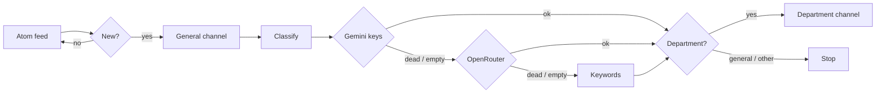

<p align="center">
  
</p>

<p align="center">
  
  
  
  
  
  
</p>

# monreqAI-CNAM-Liban (C edition)

A pure-C11 port of the [Python monreqAI tool](https://github.com/E-Vex/monreqAI-CNAM-Liban/tree/main-py)
that watches the ISSAE / Cnam-Liban Blogger announcements page and forwards
each new post to the right Telegram channel after classifying it via
Gemini / OpenRouter / keyword fallback.

The tool is a faithful port: it reads the same env vars, writes the same
`seen.json` schema (v2), uses the same prompt, the same dead-key status
sets, the same two-phase state semantics, the same message format, and
the same CLI flags. A `seen.json` written by the Python tool can be read
by this C tool and vice versa.

- **One runtime dependency tree**: libcurl + libxml2. cJSON is vendored
  under `third_party/cjson/` so the build does not require a `libcjson-dev`
  system package.
- **One-shot process** (run from cron every ~20 min, not a daemon).
- **~80 KiB native binary**, no Python interpreter, no virtualenv.
- **Memory-safe**: ASan / UBSan clean; atomic state writes; corrupt JSON
  is quarantined to `seen.json.corrupt` rather than overwritten.

---

## Table of contents

- [The problem](#the-problem)
- [How it works](#how-it-works)
- [Departments](#departments)
- [Prerequisites](#prerequisites)
- [Building](#building)
- [Quick start](#quick-start)
- [Configuration](#configuration)
- [CLI reference](#cli-reference)
- [State file format](#state-file-format)
- [Classification tiers](#classification-tiers)
- [HTTP client behavior](#http-client-behavior)
- [Telegram message format](#telegram-message-format)
- [Running from cron](#running-from-cron)
- [Exit codes](#exit-codes)
- [Testing](#testing)
- [Troubleshooting](#troubleshooting)
- [Project layout](#project-layout)
- [License](#license)

---

## The problem

ISSAE's announcements go up on a Blogger page with no notification
attached. If you don't check it, you find out about a moved exam or a
changed deadline after the fact, usually from a classmate who happened
to look. Most posts aren't about you either: an Informatique student
doesn't need every Génie Civil memo.

This tool watches the page and pings you only when something new and
relevant appears.

## How it works

The site runs on Blogger, so rather than scraping HTML the monitor reads
the Atom feed:

```
http://annonces.isae.edu.lb/feeds/posts/default?max-results=25
```



Each run fetches the feed, diffs it against local state, posts every new
item to the general channel, classifies it, and forwards it to that
department's channel if one is configured. State is saved after every
announcement, so a `SIGKILL` mid-run loses at most one item's progress.

## Departments

All nine units listed by the institute are supported. Each gets its own
channel; leave a variable unset to skip that department.

| Department (French)                                | Category key    | Channel env var               |
|----------------------------------------------------|-----------------|-------------------------------|
| Génie Informatique                                 | `informatique`  | `TELEGRAM_CHANNEL_INFORMATIQUE`|
| Génie Civil                                        | `civil`         | `TELEGRAM_CHANNEL_CIVIL`       |
| Génie Électrique                                   | `electrique`    | `TELEGRAM_CHANNEL_ELECTRIQUE`  |
| Génie Mécanique                                    | `mecanique`     | `TELEGRAM_CHANNEL_MECANIQUE`   |
| Génie des Procédés                                 | `procedes`      | `TELEGRAM_CHANNEL_PROCEDES`     |
| Économie et Gestion                                 | `economie`      | `TELEGRAM_CHANNEL_ECONOMIE`    |
| Statistique et Mathématiques Appliquées             | `statistique`   | `TELEGRAM_CHANNEL_STATISTIQUE` |
| Sciences Physiques et Mathématiques                 | `physique`      | `TELEGRAM_CHANNEL_PHYSIQUE`    |
| Langues                                            | `langues`       | `TELEGRAM_CHANNEL_LANGUES`     |

Plus two pseudo-categories used by the classifier:

| Pseudo-category | Meaning                                              | Routing                  |
|-----------------|------------------------------------------------------|--------------------------|
| `general`       | Concerns all students (fees, holidays, closures...)  | General channel only     |
| `other`         | Not aimed at students (job adverts, tenders...)      | General channel only     |

Run `isae_monitor --list-departments` to see which channels your `.env`
configures.

## Prerequisites

| Dependency  | Debian / Ubuntu             | macOS (Homebrew)        | Fedora / RHEL          |
|-------------|------------------------------|-------------------------|------------------------|
| libcurl     | `libcurl4-openssl-dev`      | `curl`                  | `libcurl-devel`        |
| libxml2     | `libxml2-dev`               | `libxml2`               | `libxml2-devel`        |
| C compiler  | `build-essential`          | Xcode CLT               | `gcc`                  |
| make / cmake| `make cmake`               | `make cmake`            | `make cmake`           |

**cJSON is vendored** under `third_party/cjson/` (v1.7.18, MIT license).
You do **not** need `libcjson-dev` installed.

## Building

### Make (recommended)

```bash
make            # release build -> ./isae_monitor
make debug      # ASan + UBSan build
make test       # run tests/test_parity.sh
make check-deps # verify libcurl / libxml2 are available
```

### CMake

```bash
cmake -B build -S .
cmake --build build
./build/isae_monitor --version
```

The build produces a single `isae_monitor` binary (~80 KiB stripped).

## Quick start

```bash
git clone -b main-c https://github.com/E-Vex/monreqAI-CNAM-Liban.git
cd monreqAI-CNAM-Liban
make

# 1. Configure
cp .env.example .env
# Edit .env: set TELEGRAM_BOT_TOKEN and TELEGRAM_CHANNEL_GENERAL.
# At least one of GEMINI_API_KEYS or OPENROUTER_API_KEY is recommended
# (otherwise keyword fallback handles everything).

# 2. Verify config
./isae_monitor --check

# 3. Mark current feed entries as seen (avoid a 25-message flood on first run)
./isae_monitor --bootstrap

# 4. Test the next run (no Telegram sends, just classify + print)
./isae_monitor --dry-run

# 5. Real run (sends to Telegram)
./isae_monitor --quiet
```

## Configuration

The binary reads configuration in this order (later wins):

1. Compiled-in defaults (see `src/config.c`).
2. `.env` in the current working directory (auto-loaded once per process;
   existing environment variables are **not** overridden, mirroring
   `set -a; source .env; set +a`).
3. Explicit environment variables (`export FEED_URL=...`).
4. CLI flags (`--dry-run`, `--bootstrap`, `--check`, `--list-departments`,
   `--quiet`).

### Environment variables

| Variable                       | Default                                                             | Notes |
|--------------------------------|---------------------------------------------------------------------|-------|
| `FEED_URL`                     | `http://annonces.isae.edu.lb/feeds/posts/default?max-results=25`    | HTTP deliberately (server has flaky TLS). |
| `STATE_FILE`                   | `seen.json`                                                         | Relative to CWD. `ISAE_STATE_FILE` accepted as a legacy alias. |
| `GEMINI_API_KEYS`              | (unset)                                                             | Comma-separated. The classifier rotates through them. |
| `GEMINI_API_KEY`               | (unset)                                                             | Singular form tolerated when the plural is empty. |
| `GEMINI_MODEL`                 | `gemini-2.5-flash`                                                  | Older models may 400 on `thinkingConfig`; the 400 fallback retries once. |
| `OPENROUTER_API_KEY`           | (unset)                                                             | Tried only if every Gemini key is dead or unparseable. |
| `OPENROUTER_MODEL`             | `meta-llama/llama-3.3-70b-instruct`                                | |
| `TELEGRAM_BOT_TOKEN`           | (unset)                                                             | From `@BotFather`. |
| `TELEGRAM_CHANNEL_GENERAL`     | (unset)                                                             | Every announcement goes here first, unclassified. |
| `TELEGRAM_CHANNEL_<DEPT>`      | (unset)                                                             | One per department (see [Departments](#departments)). |
| `TELEGRAM_CHANNEL_CS`          | (unset)                                                             | Legacy alias for `informatique`. Used only if the canonical var is unset. |
| `REQUEST_TIMEOUT`              | `20`                                                                | Seconds. Applies to all HTTP calls (feed, Gemini, OpenRouter, Telegram). |
| `MAX_RETRIES`                  | `3`                                                                 | Total attempts. Retries on network errors and `{408, 425, 429, 500, 502, 503, 504}`. |
| `SEND_INTERVAL`                | `1.2`                                                               | Minimum seconds between two Telegram sends (per-bot throttle, `CLOCK_MONOTONIC`). |
| `STATE_HISTORY`                | `1000`                                                              | Maximum entries kept in `seen.json`; pruned on save. |

## CLI reference

```text
isae_monitor [OPTIONS]

  --dry-run            Classify and print, send nothing to Telegram.
  --bootstrap          Mark every current feed entry as seen without
                       notifying. Use on first install to avoid a backlog flood.
  --check              Print resolved config and exit (0 if telegram is usable, 1 if not).
  --list-departments   Print the 9-department table and exit.
  --quiet              Suppress per-announcement progress output.
  --version            Print version information and exit.
  --help               Show this help message and exit.
```

The tool is **one-shot**: it fetches the feed once, processes pending
entries, and exits. Run it from cron; do not loop it.

### `--check`

Prints the resolved configuration (which env vars are set, which
defaults are in effect) and any warnings. Exits `0` if telegram is
usable (bot token + at least one channel), `1` otherwise. Useful in
setup scripts to gate on readiness.

### `--bootstrap`

Marks every current feed entry as seen (`g=true, c="bootstrap"`) without
sending any Telegram messages. Use on first install so the first real
run only processes *new* announcements, not the entire 25-entry backlog.

### `--dry-run`

Classifies every pending announcement and prints what would be sent to
Telegram, but does not actually call the Telegram API. The state file
is **not** updated by a dry-run (so you can re-run without losing
progress). Useful for validating AI provider configuration.

### `--list-departments`

Prints the 9-department table with the canonical env var name and a
`configured` / `-` marker showing which channels your `.env` is
populating. Works without network access or AI keys.

### `--quiet`

Suppresses the per-announcement `  Title` / `    -> Category (via source)`
progress lines. The run summary at the end is still printed (unless
suppressed by `2>/dev/null`).

## State file format

The state file is JSON v2 and is **interchangeable** with the Python
tool's `seen.json`:

```json
{
  "version": 2,
  "seen": {
    "tag:blogger.com,2025:post-12345": {
      "g": true,
      "c": "informatique",
      "t": 1736291400
    }
  }
}
```

| Field | Meaning |
|-------|---------|
| `g`   | bool: announcement has been delivered to the general channel. |
| `c`   | string category or `null` (classification pending). The literal `"bootstrap"` marks items touched by `--bootstrap`. |
| `t`   | int Unix timestamp of last touch (set on entry creation only; used as the sort key for pruning). |

### Two-phase state semantics

`g` and `c` are mutated **independently**:

- `g=true` is set only after a **successful** general-channel send.
  A failed general send leaves `g=false`, so the announcement is retried next run.
- `c=<category>` is set only after a **successful** department-channel send.
  A failed department send leaves `c=null`, so the announcement is re-classified
  AND re-routed next run (even though classification "succeeded" the first time).

This means an announcement can be in any of four states:

| `g`     | `c`         | Meaning                                                     |
|---------|-------------|-------------------------------------------------------------|
| `false` | `null`      | Brand new; needs both general send and classification.     |
| `true`  | `null`      | Sent to general; classification pending or dept send failed. |
| `false` | `"x"`       | (Rare) General send failed but classification + dept send succeeded. |
| `true`  | `"x"`       | Fully processed.                                            |

### Atomic write

State writes are atomic via the standard pattern:

1. Write JSON to `<state>.tmp.<pid>` in the **same directory** as the target.
2. `fflush` → `fsync(fileno)` → `fsync(parent dir)` → `rename(temp, target)`.

If the process is killed mid-write, the temp file is left behind (cleaned
up on the next run by the same `pid` collision-free naming) and the
target file is untouched.

### Corruption recovery

If the state file fails JSON parsing, the corrupt file is **moved** to
`<state>.corrupt` (not deleted) so you can inspect it. The run starts
with an empty state and the `recovered_from_corruption` flag is set;
this surfaces in the run report as a warning recommending `--bootstrap`.

### Migration

Old state files are migrated in-memory on load:

| Source shape | Detection | Result |
|--------------|-----------|--------|
| Plain JSON array of IDs (v0) | `isarray(data)` | Each id gets `g=true, c=null` (was already sent). |
| Object with `general_sent` / `classified` (v1) | `data.general_sent or data.classified` | `general_sent` ids get `g=true`; `classified` ids also get `c="unknown"` (v1 didn't store the category). |
| `{version:2, seen:{...}}` (v2) | `data.version == 2` | Loaded verbatim. |
| Anything else | falls through | Quarantined to `.corrupt`; state starts empty. |

## Classification tiers

The classifier tries three sources in order:

### 1. Gemini (`gemini-2.5-flash` by default)

- Endpoint: `https://generativelanguage.googleapis.com/v1beta/models/<model>:generateContent`
- API key sent as the `x-goog-api-key` **header** (never as a `?key=` URL
  parameter, so it cannot leak via logged URLs).
- Payload includes `generationConfig.thinkingConfig.thinkingLevel=low`
  and a `responseSchema` restricting the output to `{"category": "<enum>"}`.
- **400 fallback**: if the model rejects `thinkingConfig` / `responseSchema`
  (older models do), the request is retried once with `generationConfig`
  stripped to just `{"maxOutputTokens": 512}`.
- Response is read **defensively**: a `promptFeedback.blockReason`,
  empty `candidates`, missing `content.parts`, or empty text all produce
  a structured error instead of an `IndexError`-style crash.
- Dead-key status set: `{400, 401, 403, 404, 429}`. A dead key is skipped
  for the rest of the run; it is **not** persisted across runs (the
  process is short-lived, and the HTTP layer's backoff covers the
  cross-run case).

Multiple Gemini keys are supported via `GEMINI_API_KEYS` (comma-separated).
The classifier rotates through them in order, skipping dead ones.

### 2. OpenRouter (`meta-llama/llama-3.3-70b-instruct` by default)

- Endpoint: `https://openrouter.ai/api/v1/chat/completions`
- Headers: `Authorization: Bearer <key>`, `HTTP-Referer: https://github.com/E-Vex/monreqAI-CNAM-Liban`,
  `X-Title: ISAE Announcements Monitor` (attribution on the OpenRouter dashboard).
- Payload: `temperature=0`, `response_format={"type":"json_object"}`, `max_tokens=512`.
- Dead-key status set: `{401, 402, 403}`. Note this is intentionally
  asymmetric with Gemini -- 400/404/429 from OpenRouter is treated as
  a transient retryable failure rather than a dead key.

### 3. Keyword fallback

The keyword fallback is the last line of defense; it never throws and
always returns a valid category. Algorithm:

1. If any `OTHER_MARKER` (e.g. `"offre d'emploi"`, `"وظيفة"`) is a
   substring of the normalized title+summary, return `other`. (Checked
   before department scoring.)
2. For each department, score its keywords:
   - **TITLE_WEIGHT = 3** (multi-word keyword: ×2)
   - **SUMMARY_WEIGHT = 1** (multi-word keyword: ×2)
   - `elif` between title and summary: a keyword that appears in BOTH
     is counted only once (in the title).
3. If exactly one department has the max score, that's the winner. Ties
   → no decision → fall through to step 4.
4. If any `GENERAL_MARKER` (e.g. `"tous les etudiants"`, `"inscription"`)
   matches, return `general`.
5. Else → return `general` (conservative default; better to over-share
   than misroute).

The keyword table covers **all nine departments** in French, English,
**and Arabic** (the announcements page publishes in both). See
`src/departments.c` for the full list.

## HTTP client behavior

The HTTP client (`src/httpclient.c`) wraps libcurl and applies the same
retry / backoff policy as the Python reference:

| Behavior                              | Setting |
|---------------------------------------|---------|
| TLS verification                      | **Disabled** (server has flaky TLS; matches Python `verify=False`). Can be flipped via `http_client_config_t.disable_tls_verify`. |
| Retryable status codes                | `{408, 425, 429, 500, 502, 503, 504}` plus network failures (`status_code == 0`). |
| Backoff                               | `min(2^attempt, 30) * jitter[0.5, 1.0)` seconds. |
| `Retry-After` header                   | Honored, capped at 60 seconds. |
| Response body cap (successful)         | 1 MiB (DoS guard; legitimate feeds are <100 KiB). |
| Response body cap (error messages)    | 800 bytes (truncated for the error string). |
| User-Agent                            | `ISAEMonitor/2.0 (+https://github.com/E-Vex/monreqAI-CNAM-Liban)`. |

The same client is used for the feed fetch, Gemini, OpenRouter, and
Telegram calls; each gets the retry/backoff policy applied.

## Telegram message format

Messages are sent with `parse_mode=HTML` and `disable_web_page_preview=true`.
Layout (lines joined with `\n\n`):

```
<b>[Label]</b> <b>Title</b>      (omit [Label] when category is NULL)

<i>published</i>

summary                          (omitted if empty)

link                             (omitted if empty; not HTML-escaped)
```

- Title is HTML-escaped (`& < >` → `&amp; &lt; &gt;`) and truncated to
  250 **chars** (UTF-8 codepoint count, not bytes) before escaping.
- Summary is HTML-escaped and truncated to 400 chars.
- If the total message exceeds 3900 chars, it is hard-truncated and a
  single U+2026 ellipsis (`…`) is appended.
- The throttle uses `CLOCK_MONOTONIC` (immune to wall-clock jumps) and
  measures from the **end** of the previous send, so the actual gap
  between two sends is `max(send_interval - duration_of_previous_send, 0)`.

## Running from cron

A 20-minute interval is a good default for ISSAE announcements:

```cron
*/20 * * * *  cd /path/to/monreqAI-CNAM-Liban && ./isae_monitor --quiet >> /var/log/isae_monitor.log 2>&1
```

The state file is written to the current working directory (or wherever
`STATE_FILE` points). Make sure the cron user has write access to it.

## Exit codes

| Code | Meaning |
|------|---------|
| `0`  | Successful run with no errors. |
| `1`  | Run completed but had errors in the report (general send failed, dept send failed, dead-key note, corruption recovery). Also used by `--check` when telegram is not fully configured. |
| `2`  | Feed fetch or parse failure. |
| `130`| `SIGINT` caught mid-run (128 + 2). |

## Testing

### Unit tests

The `tests/` directory contains four focused unit-test suites. Each
links the relevant module(s) directly and runs without network access:

```bash
gcc -std=c11 ... src/models.c tests/test_normalize.c -o /tmp/test_normalize && /tmp/test_normalize
gcc -std=c11 ... src/state.c tests/test_state.c             -o /tmp/test_state      && /tmp/test_state
gcc -std=c11 ... src/{models,departments,keywords}.c tests/test_keywords.c -o /tmp/test_keywords && /tmp/test_keywords
gcc -std=c11 ... src/{models,feed,httpclient}.c tests/test_feed.c -o /tmp/test_feed && /tmp/test_feed
gcc -std=c11 ... src/{models,departments,telegram,httpclient}.c tests/test_telegram.c -o /tmp/test_telegram && /tmp/test_telegram
```

Or use the Makefile:

```bash
make test   # runs tests/test_parity.sh
```

The unit tests pin down:
- French accent folding and Arabic diacritics / alef folding
- HTML entity unescaping (named, numeric, both >127 and >2047)
- v0/v1 → v2 state migration, two-phase g/c semantics, corruption quarantine,
  pruning
- Keyword scoring (TITLE_WEIGHT, multi-word ×2, `elif`, ties → GENERAL,
  OTHER_MARKERS first, GENERAL default)
- Atom `<id>` extraction, reverse to oldest-first, rel=alternate, drop
  empty IDs, `(sans titre)` / `date inconnue` fallbacks, strip_html
- Telegram HTML escaping, `[Label]` prefix, U+2026 truncation, UTF-8
  boundary truncation

### Valgrind

```bash
make valgrind
```

Runs the binary under `valgrind --leak-check=full`. Expected output:
zero leaks, zero errors. The `--dry-run` mode is used (no network sends)
so the run is deterministic.

### Parity test

`tests/test_parity.sh` runs the binary's CLI commands and checks exit
codes / output. Extend it as needed for your environment.

## Troubleshooting

### "feed error" with exit code 2

- Check network connectivity: `curl -v http://annonces.isae.edu.lb/feeds/posts/default?max-results=5`
- The feed URL is HTTP (not HTTPS) on purpose; the server has flaky TLS.
  If your network blocks HTTP, override `FEED_URL` to use HTTPS.

### "warning: no AI provider configured"

The classifier will fall back to keyword matching for every
announcement. This works for most department-named posts but may miss
nuanced ones. Set at least one of `GEMINI_API_KEYS` or
`OPENROUTER_API_KEY` for best results.

### "warning: telegram not fully configured"

You're missing either `TELEGRAM_BOT_TOKEN` or `TELEGRAM_CHANNEL_GENERAL`.
Both are required for any notification to be sent. Per-department
channels are optional but recommended.

### Gemini keys disabled for this run

If you see this in the run report, one of your Gemini keys returned a
400/401/403/404/429. The key is disabled for the rest of the run; the
next run will retry it from scratch (per-run only, not persisted).

Common causes:
- **401 / 403**: invalid or revoked key. Get a new one from Google AI Studio.
- **404**: wrong model name. Pin `GEMINI_MODEL=gemini-2.5-flash` (older models are shut down).
- **429**: rate limited. Reduce `MAX_RETRIES` or add more keys to `GEMINI_API_KEYS`.
- **400**: the model rejected `thinkingConfig` or `responseSchema`. The
  tool retries once without them; if that also fails, the model is
  probably too old. Use `gemini-2.5-flash`.

### State file was corrupt

The previous state file failed JSON parsing and was moved to
`<state>.corrupt`. The run started with an empty state. Run
`isae_monitor --bootstrap` to mark the current feed entries as seen.

### `seen.json` is growing unbounded

It shouldn't -- `STATE_HISTORY=1000` caps it. But if you set
`STATE_HISTORY` very high, the file can grow. Reduce it and run once;
the next save will prune.

## Project layout

```
.
├── CMakeLists.txt             # CMake build (alternative to Makefile)
├── Makefile                   # GNU Make build (recommended)
├── README.md                  # this file
├── LICENSE                    # MIT
├── .env.example               # sample env file (copy to .env)
├── .gitignore
├── monreqai_c_logo.png
├── include/
│   └── isae_monitor/
│       ├── common.h           # version, error codes, limits
│       ├── config.h           # settings_t + config_load()
│       ├── models.h           # announcement_t, normalize_text, strip_html, ...
│       ├── departments.h      # 9 departments + aliases + keywords
│       ├── keywords.h         # keyword fallback classifier
│       ├── providers.h        # Gemini / OpenRouter calls
│       ├── classifier.h       # 3-tier classifier with dead-key tracking
│       ├── httpclient.h       # libcurl wrapper with retry / backoff
│       ├── feed.h             # Atom feed parser
│       ├── telegram.h         # Telegram client (HTML, throttle)
│       ├── pipeline.h         # one-shot run + report
│       └── dotenv.h           # .env auto-loader
├── src/                       # implementations of the above
├── tests/
│   ├── test_normalize.c       # UTF-8 / Arabic / HTML entity tests
│   ├── test_state.c           # state round-trip, migration, quarantine
│   ├── test_keywords.c        # keyword classifier parity tests
│   ├── test_feed.c            # Atom parsing tests
│   ├── test_telegram.c        # message format tests
│   └── test_parity.sh         # smoke test
└── third_party/
    └── cjson/                 # vendored cJSON v1.7.18 (MIT)
        ├── cJSON.h
        ├── cJSON.c
        └── README.md
```

## License

MIT, same as the Python reference. See [LICENSE](LICENSE).

The vendored cJSON library under `third_party/cjson/` is also MIT
licensed (Copyright (c) 2009-2017 Dave Gamble and cJSON contributors).
