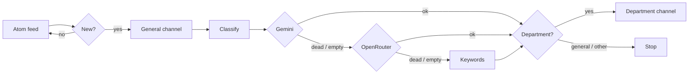

<p align="center">
  
</p>

<br/>

## The problem

ISSAE's announcements go up on a Blogger page with no notification attached. If you don't check it, you find out about a moved exam or a changed deadline after the fact, usually from a classmate who happened to look. Most posts aren't about you either: an Informatique student doesn't need every Génie Civil memo.

This watches the page and pings you only when something new and relevant appears.

## Features

- Reads the institute's **Atom feed** — no HTML scraping, no fragile selectors
- **Three-tier classification**: Gemini → OpenRouter → accent-folded keyword fallback (French + English + Arabic)
- **Nine departments**, each routable to its own Telegram channel
- **Two-phase state tracking**: a message that reached the general channel but failed classification is retried without being re-sent
- **Atomic state writes**: a power loss mid-run never corrupts `seen.json`
- **Dead-key disablement**: a 401/403/404 Gemini key is skipped for the rest of the run, not retried per announcement
- One runtime dependency (`feedparser`); everything else is stdlib

## How it works

The site runs on Blogger, so rather than scraping HTML the monitor reads the Atom feed:

```
https://annonces.isae.edu.lb/feeds/posts/default
```



Each run fetches the feed, diffs it against local state, posts every new item to a general channel, classifies it, and forwards it to that department's channel if one is configured.

## Departments

All nine units listed by the institute are supported. Each gets its own channel; leave a variable unset to skip that department.

| Department | Category | Channel variable |
|---|---|---|
| Génie Informatique | `informatique` | `TELEGRAM_CHANNEL_INFORMATIQUE` |
| Génie Civil | `civil` | `TELEGRAM_CHANNEL_CIVIL` |
| Génie Électrique | `electrique` | `TELEGRAM_CHANNEL_ELECTRIQUE` |
| Génie Mécanique | `mecanique` | `TELEGRAM_CHANNEL_MECANIQUE` |
| Génie des Procédés | `procedes` | `TELEGRAM_CHANNEL_PROCEDES` |
| Économie et Gestion | `economie` | `TELEGRAM_CHANNEL_ECONOMIE` |
| Statistique et Mathématiques Appliquées | `statistique` | `TELEGRAM_CHANNEL_STATISTIQUE` |
| Sciences Physiques et Mathématiques | `physique` | `TELEGRAM_CHANNEL_PHYSIQUE` |
| Langues | `langues` | `TELEGRAM_CHANNEL_LANGUES` |

Plus two pseudo-categories: `general` (institute-wide, goes to `TELEGRAM_CHANNEL_GENERAL`) and `other` (not aimed at students; never routed).

Adding a tenth department means adding one entry to `isae_monitor/departments.py`. The prompt, the valid label set, the env var and the keyword fallback all derive from that registry, so nothing else needs touching.

`TELEGRAM_CHANNEL_CS` from v1 still works and maps to `informatique`.

## Setup

### Prerequisites

- Python 3.9 or newer
- A Telegram account with permission to create channels and add a bot to them
- At least one AI key (Gemini recommended; OpenRouter as fallback). Without any, the monitor falls back to keyword matching, which is rough but functional.

### 1. Create a Telegram bot

1. Open a chat with [@BotFather](https://t.me/BotFather) on Telegram.
2. Send `/newbot` and follow the prompts for name and username.
3. Copy the token it gives you — that's `TELEGRAM_BOT_TOKEN`.

The bot only needs to send messages, no admin rights beyond being a member of the channels it posts to.

### 2. Create channels and get their chat IDs

For every channel you want to use (one general channel + one per department you care about):

1. In Telegram, create a new channel. **Public** channels have a `@username` you can use directly as the chat ID. **Private** channels expose a numeric ID instead.
2. Add the bot you just created as an administrator of the channel. The bot must have the *Post Messages* permission.
3. To find a private channel's numeric ID:
   - Forward any message from the channel to [@userinfobot](https://t.me/userinfobot), or
   - Look at the channel's `t.me/c/XXXXXXX` link — the numeric part, prefixed with `-100`, is the ID (e.g. `t.me/c/1234567890` → `-1001234567890`).

You do not have to configure all nine department channels. Leave the env vars for the ones you don't care about unset and the monitor will simply skip routing for them.

### 3. Get AI keys

- **Gemini**: <https://aistudio.google.com/apikey> — the free tier is enough for a personal monitor. You can supply several keys comma-separated; dead ones are disabled for the rest of the run, not retried per announcement.
- **OpenRouter** (optional fallback): <https://openrouter.ai/keys> — useful when Gemini is down or out of quota. The default model is `meta-llama/llama-3.3-70b-instruct`.

### 4. Install and configure

```bash
git clone https://github.com/E-Vex/monreqAI-CNAM-Liban.git
cd monreqAI-CNAM-Liban
python3 -m venv .venv && source .venv/bin/activate
pip install -r requirements.txt

cp .env.example .env    # then fill it in
set -a; source .env; set +a
```

Check what it resolved:

```bash
python3 -m isae_monitor --check
python3 -m isae_monitor --list-departments
```

`--check` exits with status 1 if Telegram is not usable — useful in setup scripts.

### 5. Bootstrap the backlog

**Before the first real run**, claim the existing backlog so you aren't flooded with the whole feed at once:

```bash
python3 -m isae_monitor --bootstrap
```

### 6. Dry run

Then try it without sending anything:

```bash
python3 -m isae_monitor --dry-run
```

## Running

```bash
python3 -m isae_monitor
```

It's a one-shot process, not a daemon. On Linux or macOS, every 20 minutes:

```cron
*/20 * * * * cd /path/to/monreqAI-CNAM-Liban && \
  set -a && . ./.env && set +a && \
  .venv/bin/python -m isae_monitor --quiet >> monitor.log 2>&1
```

State lives in `seen.json` next to the project, so nothing is re-sent across runs. Writes are atomic: if the machine loses power mid-write, the previous file survives intact.

### Options

| Flag | Effect |
|---|---|
| `--dry-run` | Classify and print, send nothing |
| `--bootstrap` | Mark the current feed as seen without notifying |
| `--check` | Print resolved config and exit |
| `--list-departments` | Show departments and their channel variables |
| `--quiet` | Summary only, for cron |
| `--version` | Print version and exit |

### Sample notification

A typical message that lands in a department channel:

```
[Génie Civil]
Génie Civil - Examens d'admission

Mon, 06 Jan 2025 09:30:00 GMT

Les oraux d'admission en Génie Civil se tiendront du 15 au 19 janvier.
Salle B204. Présentez-vous 15 minutes avant l'horaire fixé.

https://annonces.isae.edu.lb/2025/01/exames-civil.html
```

The `[Department]` prefix only appears on routed messages; the general channel receives the same body without it.

## Classification

Three tiers, in order:

1. **Gemini**, across as many keys as you supply. Asked for a JSON response constrained to the valid category list, so the answer is parsed exactly rather than scraped out of prose. Dead keys are disabled for the rest of the run instead of being retried once per announcement.
2. **OpenRouter**, as fallback, in JSON mode.
3. **Keyword matching**, if every provider fails. Covers all nine departments in French, English and Arabic, and scores each department rather than taking whichever list matched first. Defaults to `general` when nothing matches, on the principle that over-sharing beats routing to the wrong department.

## Configuration

| Variable | Purpose |
|---|---|
| `GEMINI_API_KEYS` | Comma-separated Gemini keys |
| `GEMINI_API_KEY` | Singular form, tolerated if you only have one |
| `GEMINI_MODEL` | Gemini model (default: `gemini-2.5-flash`) |
| `OPENROUTER_API_KEY` | Fallback provider key |
| `OPENROUTER_MODEL` | Fallback model (default: `meta-llama/llama-3.3-70b-instruct`) |
| `TELEGRAM_BOT_TOKEN` | Bot used for delivery |
| `TELEGRAM_CHANNEL_GENERAL` | Gets every announcement |
| `TELEGRAM_CHANNEL_<DEPT>` | Per-department channels (table above) |
| `TELEGRAM_CHANNEL_CS` | Legacy: maps to `informatique` if the new var is unset |
| `FEED_URL`, `STATE_FILE` | Overrides for the feed source and state path |
| `REQUEST_TIMEOUT`, `MAX_RETRIES`, `SEND_INTERVAL`, `STATE_HISTORY` | Tuning |

## State file

`seen.json` tracks what has already been handled so nothing is re-sent. Format (v2):

```json
{
  "version": 2,
  "seen": {
    "tag:blogger.com,2025:post-12345": {
      "g": true,
      "c": "informatique",
      "t": 1736291400
    }
  }
}
```

| Field | Meaning |
|---|---|
| `g` | Message has been delivered to the general channel |
| `c` | Category it was classified as, or `null` if classification is still pending |
| `t` | Unix timestamp of last touch, used for pruning |

Older formats — a plain list of IDs (v0) or two parallel lists `general_sent` / `classified` (v1) — are migrated automatically on first load. A corrupt file is moved aside as `seen.json.corrupt` and the run starts empty; the operator is told to run `--bootstrap` rather than being spammed with the entire feed.

The file is pruned to the last `STATE_HISTORY` entries (default 1000), so it stays bounded over years of use.

## Layout

```
isae_monitor/
├── departments.py   registry of all nine majors — the single source of truth
├── config.py        env parsing and validation
├── models.py        Announcement, text normalisation (accents + Arabic)
├── state.py         atomic, self-migrating, pruned state store
├── httpclient.py    stdlib HTTP with retry, backoff, Retry-After
├── feed.py          Atom fetching
├── classify/        providers, prompt, keyword fallback
├── notify/          Telegram delivery
├── pipeline.py      orchestration
└── cli.py           argument handling
```

`monitor.py` at the repo root is a backwards-compatible shim — `python3 monitor.py` still works for existing cron entries.

## Testing

```bash
pip install -r requirements-dev.txt
python3 -m pytest
```

Covers state migration from both older `seen.json` formats, atomic-write failure, corrupt-file recovery, the response-parsing bugs, Arabic routing and Telegram length limits.

## Troubleshooting

**`feed error: could not reach the feed`** — The announcements server has a flaky TLS setup. The default `FEED_URL` uses HTTP for that reason, and the HTTP client has SSL verification disabled. If your network blocks plain HTTP, set `FEED_URL` to the `https://` variant and accept that occasional failures will happen — they're retried.

**`state file was corrupt and has been moved aside`** — A previous run was interrupted mid-write, or the file was edited by hand and broke. The bad file is now at `seen.json.corrupt`. Run `python3 -m isae_monitor --bootstrap` to mark the current feed as seen without notifying, otherwise the next run will re-send everything.

**`gemini key disabled for this run`** — A Gemini key returned 401, 403, 404 or 429 and has been skipped for the rest of this run. It will be tried again next run. If it's permanently dead, remove it from `GEMINI_API_KEYS` to avoid the wasted retry.

**Telegram `429: Too Many Requests`** — You're sending faster than Telegram allows. Raise `SEND_INTERVAL` (default 1.2 seconds). The throttle is per-bot, not per-channel, so adding more channels doesn't help.

**Arabic text shows as `?` in logs** — That's your terminal's font, not the monitor. The state file and Telegram messages are written as UTF-8 regardless.

**Nothing reaches a department channel** — Check `python3 -m isae_monitor --check`: is the department listed as `configured`? Is the bot an admin of that channel? Try `--dry-run` first to see the classification decision before the send.

## Design notes

A few decisions worth recording, in case anyone has to maintain this later:

- **Atomic state writes** (`state.py`): write to a temp file, `fsync`, then `os.replace`. An interrupted write leaves the previous file intact rather than corrupting it. Without this, a SIGKILL during cron could brick the whole monitor.
- **Two-phase tracking** (`pipeline.py`): an announcement that reached the general channel but failed classification is retried on the next run, but only for classification — it isn't re-sent to the general channel. State records `g` (sent) and `c` (classified) independently.
- **Dead-key disablement is per-run, not persisted** (`classify/__init__.py`): the process is short-lived, so a cross-run cooldown would be discarded before it applied. The HTTP layer's backoff already covers the cross-run case.
- **Keyword fallback scores rather than matches first** (`classify/keywords.py`): the original took whichever department's list matched first, which made routing depend on dict ordering. The current code picks the strongest match and refuses ties.
- **Conservative default of `general`** when nothing matches: a missed department routing is an inconvenience; a wrong one sends students to the wrong channel.
- **No `requests` / `httpx`**: this runs unattended from cron on a personal machine. Every dependency is one more thing that can silently break a job nobody is watching.

## Status

- [x] Feed polling and diffing
- [x] AI classification with multi-provider fallback
- [x] All nine departments, one channel each
- [x] French, English and Arabic keyword fallback
- [x] Atomic state, bootstrap mode, rate limiting
- [ ] Multi-subscriber support (per-user department preferences)
- [ ] Delivery backends beyond Telegram

## Contributing

If you're at ISSAE or Cnam Liban and this saves you from refreshing a Blogger page, contributions are welcome. The keyword lists in `departments.py` especially benefit from real announcement samples — if you spot a notice that the fallback classifier routes wrong, send the title and the right department so the list can be tuned.

## License

MIT. See [LICENSE](LICENSE).
